# ☕ Coffee Cash Register

**Full-stack Point of Sale (POS) platform for cafés and small businesses.**

Coffee Cash Register brings sales, inventory, invoicing, reporting, user management and thermal receipt printing into one responsive, touch-friendly application.

**Angular 11 · TypeScript · Spring Boot 3.5 · Java 17 · MySQL 8 · JWT · Podman · Nginx**

---

## Application Preview

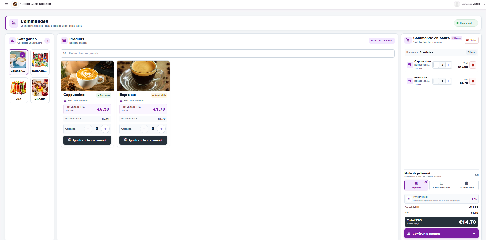

---

## Overview

Coffee Cash Register is designed around the day-to-day workflow of a point of sale: taking an order quickly, tracking stock, generating an invoice, monitoring activity and configuring the establishment from a single interface.

### Core capabilities

- Touch-oriented POS with category and product selection
- Cart, quantities, payment methods and invoice generation
- Product, category and inventory management
- Low-stock monitoring and business notifications
- Dashboard with revenue, sales and product indicators
- Reports with date filters, charts and exports
- User and cashier management
- Establishment, tax, invoice and printer configuration
- JWT authentication and role-based access control
- French and English interfaces
- Local Print Agent for thermal receipt printers
- Containerized Linux deployment with HTTPS

---

## Point of Sale

The sales interface is optimized for fast interaction in a café environment. Products are grouped by category, searchable, and added directly to the current order. The checkout panel handles quantities, payment selection, tax calculations and invoice generation.

---

## Dashboard

The dashboard provides a centralized view of business activity, including revenue, number of sales, average ticket, products sold, recent transactions, top-selling products and stock alerts.

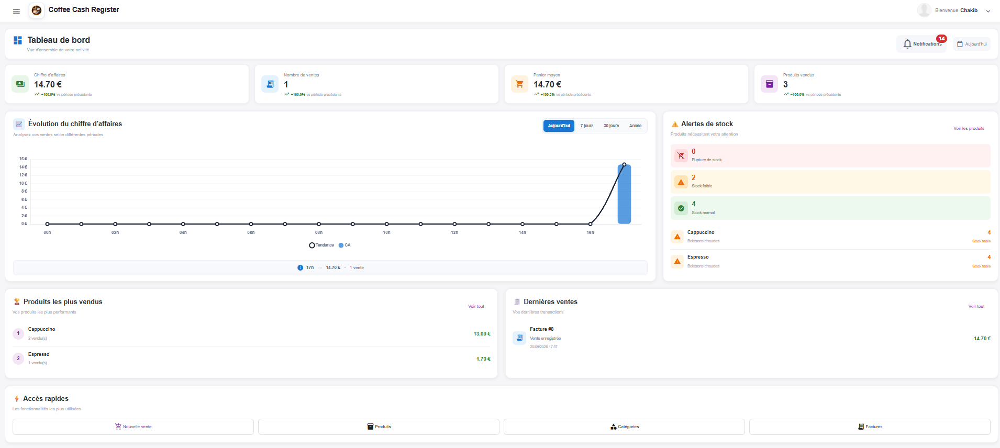

---

## Products & Inventory

Products are managed from a dedicated administration interface with images, categories, pricing, VAT, stock quantities, alert thresholds, status controls, search and pagination.

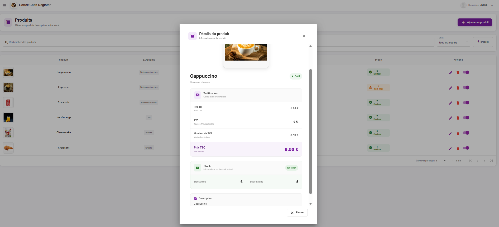

Category management complements the product catalog with searchable and paginated organization.

---

## Invoicing & Thermal Receipts

The application generates transaction documents containing establishment identity, invoice number, cashier, product lines, quantities, tax information, payment method, totals and barcode information.

<p align="center">
  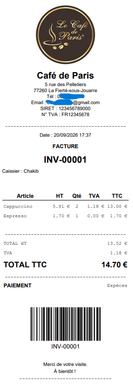
</p>

A dedicated local **Coffee Cash Register Print Agent** bridges the web application and receipt printers installed on the workstation. Printer type, connection, paper width and automatic printing can be configured from the application.

---

## Reports & Business Intelligence

The reporting workspace provides date-based analysis of sales activity with revenue, transactions, average ticket, products sold, sales evolution, payment breakdown and top-performing products. Reports can also be exported for further use.

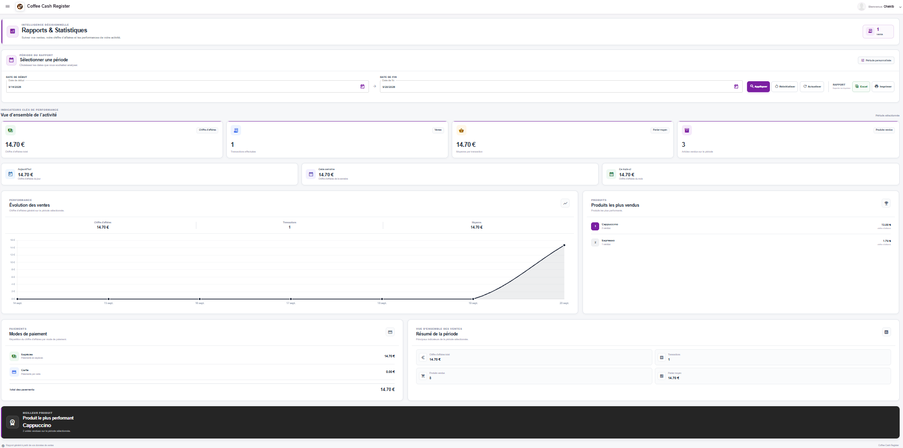

---

## Notifications & Stock Monitoring

Business events are surfaced through a notification center with read/unread tracking. The application can report events such as new sales, product activity and stock warnings.

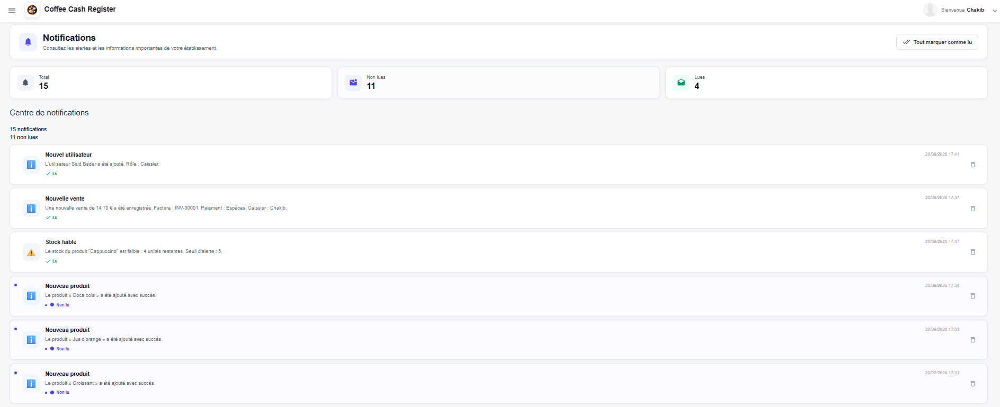

---

## Administration

Administrators can manage users and cashiers, account status and contact information. Application settings centralize establishment identity, currency, VAT, invoice numbering, notifications, branding, security and printer configuration.

<table>
  <tr>
    <td width="50%" align="center"><strong>User Management</strong></td>
    <td width="50%" align="center"><strong>Establishment Settings</strong></td>
  </tr>
  <tr>
    <td>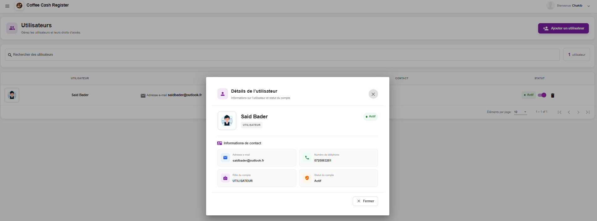</td>
    <td>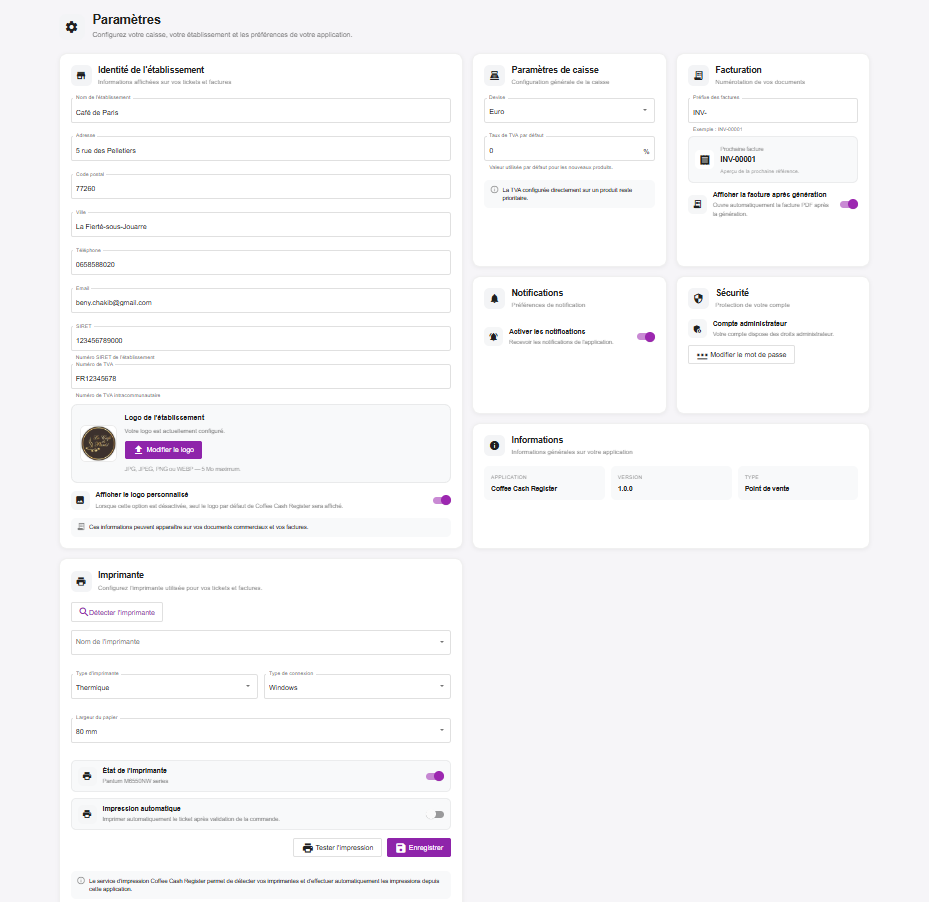</td>
  </tr>
</table>

---

## Setup, Authentication & Navigation

A guided first-run setup prepares the installation by configuring the administrator account, establishment information, branding, interface language and application activation.

Authentication protects access to POS and administration features, while responsive navigation provides direct access to the main business modules.

<table>
  <tr>
    <td width="33%" align="center"><strong>Initial Setup</strong></td>
    <td width="33%" align="center"><strong>Authentication</strong></td>
    <td width="33%" align="center"><strong>Navigation</strong></td>
  </tr>
  <tr>
    <td>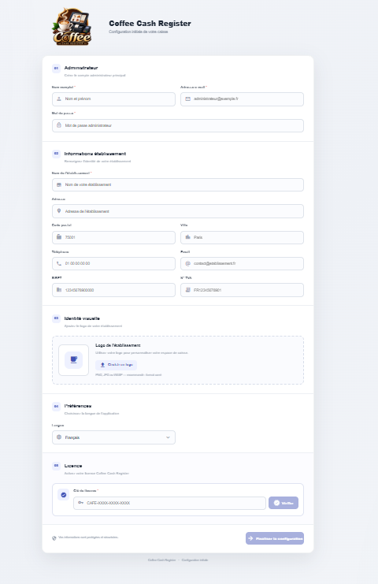</td>
    <td>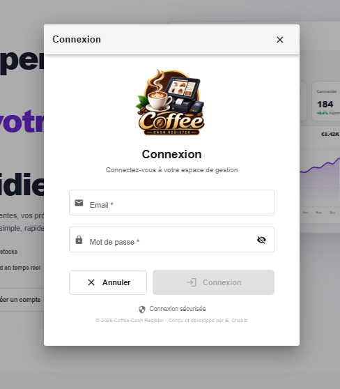</td>
    <td>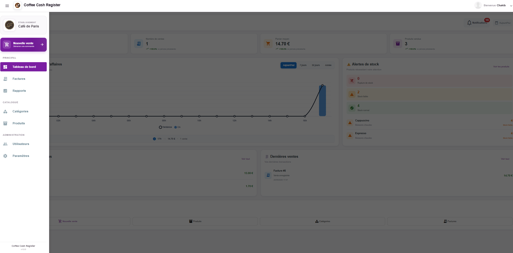</td>
  </tr>
</table>

---

## Public Product Presentation

The project also includes a public-facing presentation page introducing the POS solution before authentication.

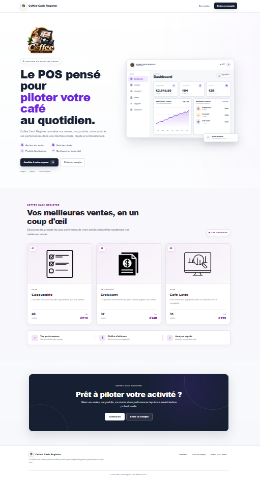

---

## Technology Stack

| Layer | Technologies |
| --- | --- |
| **Frontend** | Angular 11, TypeScript, Angular Material, SCSS, RxJS |
| **Backend** | Java 17, Spring Boot 3.5, Spring Security, REST API, JPA / Hibernate |
| **Authentication** | JWT, BCrypt, role-based authorization |
| **Database** | MySQL 8 |
| **Documents & Analytics** | PDF receipt/invoice generation, Excel export, sales charts |
| **Printing** | Coffee Cash Register local Print Agent, thermal printer integration |
| **Deployment** | Podman containers, Nginx, Linux server, HTTPS |

---

## Architecture

```text
Angular 11 Frontend
        │
        │ REST API / JWT
        ▼
Spring Boot 3.5 Backend
        │
        ├──────────────► MySQL 8
        │
        └──────────────► Local Print Agent
                              │
                              ▼
                       Thermal Printer
```

The Angular client communicates with the Spring Boot backend through REST APIs. The backend handles business rules, authentication, persistence, reporting, notifications and document generation, while MySQL stores application data. The local Print Agent provides the workstation-side bridge required for receipt printing.

---

## Security

The application uses JWT-based authentication, Spring Security, BCrypt password hashing, role-based authorization and protected administration routes. Deployment secrets and environment-specific credentials are excluded from source control.

---

## Internationalization & Responsive Design

The interface supports **French and English**. The application is designed for desktop and POS use, with responsive layouts and touch-oriented controls across sales, administration, reports, settings and authentication screens.

---

## Category Management

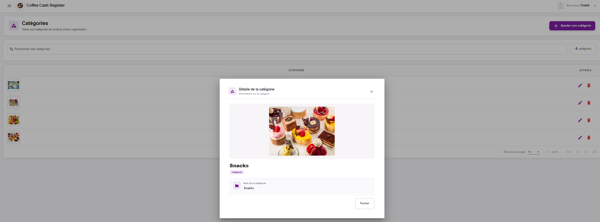

All application screenshots are available in the [`screenshots`](screenshots/) directory.

---

## Project Status

Coffee Cash Register is an actively developed full-stack project. Core POS workflows, catalog and inventory management, invoicing, reporting, notifications, administration, authentication, configuration, licensing and printing integration are implemented.

---

## Source Code

This repository is a public showcase of **Coffee Cash Register**, intended to present the project, its architecture and its main features.

The production source code is maintained in a private repository.

**Source code can be made available on request for professional review or recruitment purposes.**

---

## Author

**B. Chakib**  
Software Engineer · Full-Stack Developer

Designed and developed end-to-end, covering frontend development, backend architecture, database integration, security, reporting, deployment and local printing integration.

---

© 2026 Coffee Cash Register
